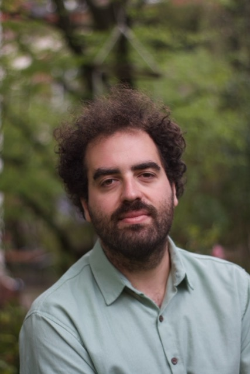

### Background

I am a **PhD candidate** at the Institute for Political Science and the Wyss Academy for Nature at the University of Bern. I hold a BSc in Economics from the University of Bern and an MSc in Economics from the University of Zurich.

**My research focuses on political science and economics:**

- **Substantive areas:** the political economy of community-based conservation in South America; community-based fire management in Viet Nam; comparative research on conflict and land-use dynamics; and narrative economics surrounding immigration  
- **Methods:** causal inference using econometric and geospatial approaches, randomized controlled trials, survey and text-based experiments  

Other than that, i love playing and recording music!

---

## Work in Progress

- **Agovic, R.**
  *Collective Land Formalization and Electoral Politics: Political Incorporation in Local Brazilian Elections.*
  Dissertation paper.

- **Nguyen, Q., Agovic, R., Jud, S., Sposito, H.**
  *Community-Based Fire Monitoring and Gender Inclusion in Viet Nam.*
  RCT experiment; two papers in preparation on barriers to collective action and on gender inclusion in community-based fire management. Intervention stats end of early June.

- **Nguyen, Q., Agovic, R., Sposito, H., Jud, S.**
  *Preferences for Community-Based Conservation.*
  Conjoint experiment, to be fielded end of May.

- **Sposito, H., Agovic, R., Jud, S., Nguyen, Q.**
  *Armed Conflict and Land-Use Dynamics: A Global Comparative Analysis.*

- **Adema, J., Agovic, R., Gehring, K., Poutvaara, P.**
  *Narrative Divide: Divergent Perspectives and Media Stereotyping of Immigrants.*

---

## Contact

Happy to talk!

remo.agovic@wyssacademy.org  
GitHub: https://github.com/RemoAgovic

